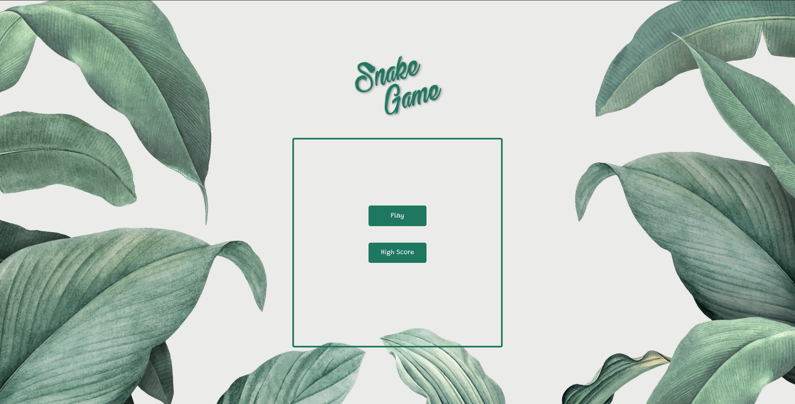
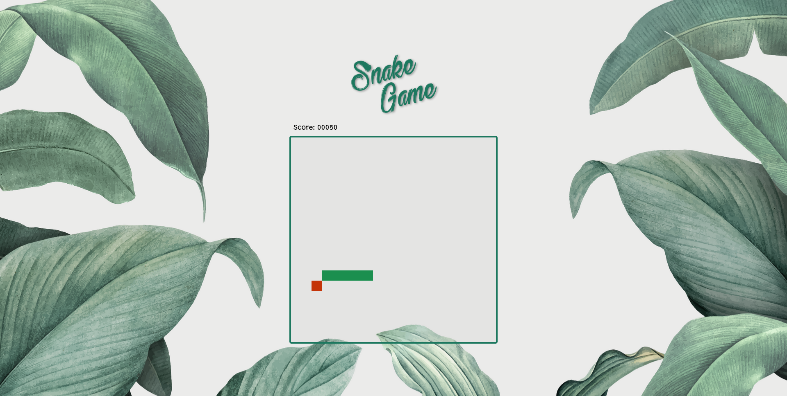

# Snake Game 2D

Projeto desenvolvido para a disiciplina de Computação Gráfica(INF1701) da Universidade Católica de Pernambuco(UNICAP).

**Exercício:** Desenvolver um jogo 2D em OpenGL

**Especificação:**

- A tela do jogo deve poder ser redimensionada mantendo a proporção do que está sendo exibido
- Você precisa implementar animação no seu jogo de forma que seja natural no contexto do jogo
- Precisa ter um score
- Precisa acabar ("Game Over")
- _OPCIONAL​_: Salvar e carregar de arquivo os melhores scores do jogo

**Desenvolvido com:** WebGL 2.0

**Fonte:**

- _Nome_: Bethanie Snake.ttf
- _Autor_: Gregory Medina, dcodesign 2019

**Screenshots:**

